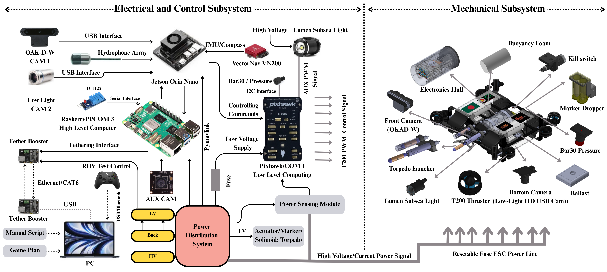

# __ABOUT__
<p align="justify">Hangor 1.0 is Team BengalSub’s debut Autonomous Underwater Vehicle (AUV) for RoboSub 2025, engineered entirely in Bangladesh. Designed for robustness and modularity, Hangor integrates real-time object detection using YOLOv8, acoustic localization, and ROS-based autonomy powered by a Jetson Orin Nano. Built on a CNC-machined aluminum frame with custom watertight enclosures, Hangor features 6-DOF maneuverability, a behavior tree mission planner, and smart subsystems for power, control, and perception. Despite limited local resources, our team successfully developed a fully operational AUV capable of dynamic underwater tasks like gate traversal, marker drop, and trash classification. Hangor reflects our commitment to hands-on innovation, aiming to push forward marine robotics and STEM outreach in Bangladesh.</p>


<hr>

# __HAUV Project Directory__
```
bengalsub_auv/
├── auv/
│   ├── __init__.py
│   ├── sensors/
│   │   
│   ├── vision/ 
│   │   ├── models/
│   │   │ 
│   │   └── utils/
│   │      
│   ├── control/
│   │   
│   ├── localization/
│   │   
│   ├── missions/
│   │   
│   ├── communication/
│   │   
│   └── utils/
│       
├── config/
│   
├── scripts/
│   
├── tests/
│   
├── data/
│  
├── requirements.txt                    
├── README.md                           
└── main.py                             
```