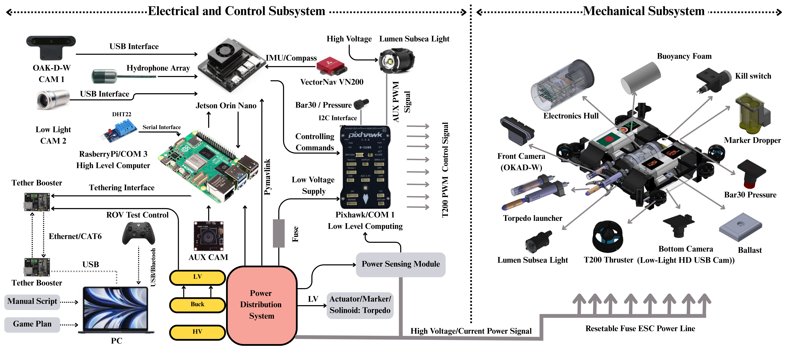

# __ABOUT__
<p align="justify">Hangor 1.0 is Team BengalSub’s debut Autonomous Underwater Vehicle (AUV) for RoboSub 2025, engineered entirely in Bangladesh. Designed for robustness and modularity, Hangor integrates real-time object detection using YOLOv8, acoustic localization, and ROS-based autonomy powered by a Jetson Orin Nano. Built on a CNC-machined aluminum frame with custom watertight enclosures, Hangor features 6-DOF maneuverability, a behavior tree mission planner, and smart subsystems for power, control, and perception. Despite limited local resources, our team successfully developed a fully operational AUV capable of dynamic underwater tasks like gate traversal, marker drop, and trash classification. Hangor reflects our commitment to hands-on innovation, aiming to push forward marine robotics and STEM outreach in Bangladesh.</p>


<hr>

# Communication Architecture:
    ```
    MacBook ←→ Ethernet ←→ TLSF1005 Switch ←→ Ethernet Cable(tether) ←→ RaspberryPI5 ←→ Jetson Nano (Ethernet port) ←→ Pixhawk
    ```

## Communication Pipeline Setup:
1. Open Terminal
2. Check RaspberryPI5 via ping.<br> 
    `ping 192.168.2.2 -t`
3. Then go to RaspberryPI terminal.<br>
    `ssh pi@192.168.2.2`
4. Access the Jetson Orin Nano.<br>
    `screen /dev/ttyACM1`